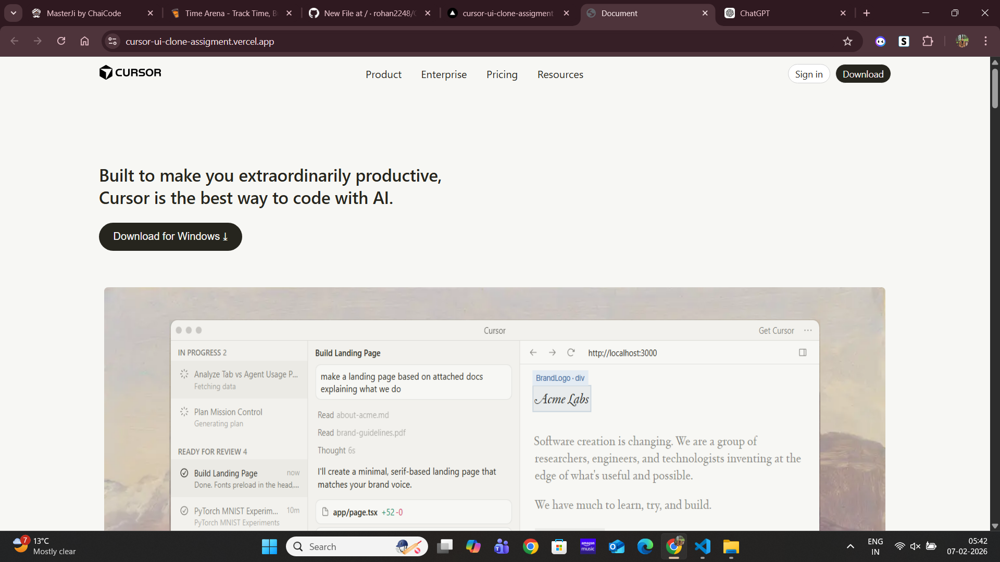

# Cursor UI Clone Assignment

This project is a **frontend clone of the Cursor UI** built as part of a UI recreation assignment. It recreates select sections of the Cursor interface using HTML and CSS.

---

##  Sections Recreated

The following UI sections from the original Cursor design were recreated in this project:

 **Header / Navigation bar**  
 **Main landing UI layout**  
 **Interactive button section**  
 **Cursor-style design elements** (as close as possible using plain HTML & CSS)

> *Note:* This is a visual clone and does not include any backend functionality or interactive JavaScript logic beyond static presentation.

---

## 🎨 Fonts and Colors Used

### **Fonts**
The UI clone uses the following fonts (applied via CSS or default system fonts if not available):

- **Primary UI font:** *cursor-gothics* (recommended)
- **Fallback fonts:** "CursorGothic Fallback", system-ui, Helvetica, Arial, sans-serif

> Note: The cursor gothics fonts are cursor's own fonts which are not public so the fonts will look different than original website. 

---

### **Color Palette**
| Purpose | Color |
|---------|--------|
| Background | `#F7F7F4` |
| Container / Card Background | `#f2f1ed` |
| Primary Text | `#26251E` (Black) |
| Secondary Text | `#6e6c69` (Gray) |

---

## 🖼️ Screenshots

 final UI design 😄


  
*Caption: Main UI cloned view*


---
## Live Demo Link 
Vercel - https://cursor-ui-clone-assigment.vercel.app/

---

## 🚀 How to View the Project on your system

1. **Clone this repository**
   ```bash
   git clone https://github.com/rohan2248/Cursor-Ui-clone-Assigment.git
   ```
2. **Open index.html in a browser**

   You can simply double-click the file
   Or serve it using a local server like Live Server (VS Code) for better development experience.

   ---

   ## File Structure
   Cursor-Ui-clone-Assigment/
├── Logo&imgs/            ← Screenshots or image assets
├── index.html            ← Main HTML file
├── style.css             ← CSS styles
├── README.md             ← This file

